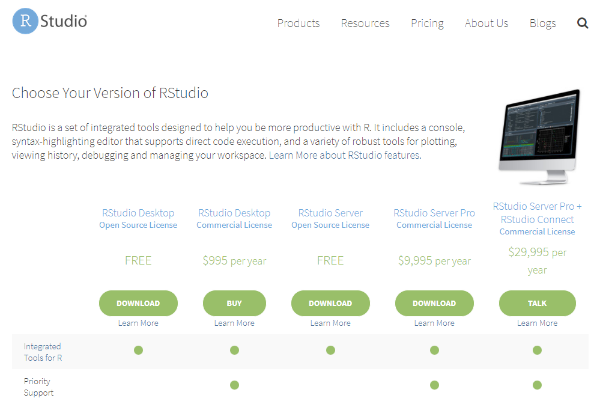
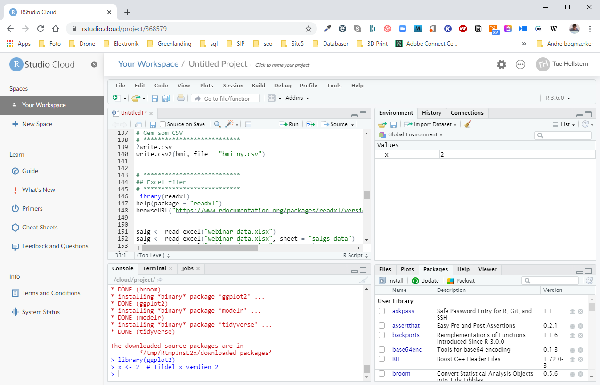

# RStudio {#rstudio}

Når R er installeret, kan du bruge det, men for at gøre det nemmere at skrive din R kode brugere vi et *Integreret udviklingsmiljø* (IDE), der hedder RStudio. 

Der er to muligheder for at bruge RStudio, enten som en applikation (Desktop) der bliver installeret på din computer eller som en cloud løsning hvor du ikke skal installere noget på din computer.

## RStudio Desktop
RStudio Desktop kan installeres på alle operativsystemer; Windows, Mac, Linux.

Rstudio Dektop fåes I to forskellige versioner; Open Source Edition og RStudio Dektop Pro. 
Det er Open Source Edition jeg bruge på dette kursus: <a href="https://rstudio.com/products/rstudio/download" target="_blank">https://rstudio.com/products/rstudio/download</a>

Selve installation er afhængig af, hvilken computer du har.

## RStudio Cloud
Du har også mulighed for at bruge cloud/onlineversionen af RStudio. Det betyder at der ikke er nødvendigt at installere noget for at bruge RSudio.
Du skal oprette dig som brugere og tilgår cloud løsningen via dette link: <a href="https://rstudio.cloud" target="_blank">https://rstudio.cloud</a>
Cloud løsningen giver dig de sammen muligheder/funktioner som desktop versionen og den sammen brugereflade.

Cloud løsningen kom i en beta udgave i starten af 2020 og der bliver stadig udviklet på den. Den er dog meget stabil så den kan uden problemer bruges.

## Brugerflade
Når du har installeret både R og RStudio, er du klar til seminaret. Starter du RStudio op, vil det typisk se således ud.

Prøv at skrive, i vinduet nederst til venstre: *demo(graphics)* og følg vejledningen på skærmen.

