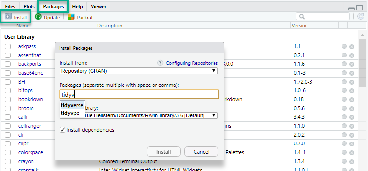

# Pakker {#pakker}
Pakker er en meget central del af R.
En pakker udvide R med lige netop den funktionalitet du har behov for.
Der findes over 15.000 pakker - så der er nok også en der kan hjælpe dig

Du finder pakkerne på CRAN (The Comprehensive R Archive Network) - <a href="https://cran.rstudio.com" target="_blank">https://cran.rstudio.com</a> - det er også her fra du kan installere dem. Det er også muligt at installere en pakke fra en fil; zip eller tar.gz

## Pakker du skal bruge

På dette kursus kommer du til at bruge følgende pakker:

* tidyverse
    * readr
    * readxl
    * tidyr
    * dplyr
    * stringr
    * ggplot2
* shiny

## Installation

Du kan installere pakker via R kode eller ved at bruge de grafiske muligher i RStudio.
Fordelen ved R kode er at du meget nemt kan gøre det sammen igen på f.eks. en anden computer.

Ved begge metoder er der to trin du skal igennem:

1. Installation af pakken
2. Aktivering af pakken - i den fil du arbejder med

**Installation**
Her bliver pakken hentet og lagt ned på din computer

**Aktivering**

Når pakken er installert, skal du aktivere pakken i den fil hvor du vil bruge den

**Via GUI**

Du kan nemt installere dine pakker via RStudio.

1. Vælg fanen **Packages** i det nederste højre vindue
2. Klik på **Install**
3. Skriv pakkens navn
4. Klik **Install**



Samme sted har du muliged for at opdatere dine pakker og du kan få yderligere information om en pakke hvis du klikker på navnet.


**Via kode**

Der er to kommandoer du skal huske den første installere pakken hvis den ikke er på din computer, den anden *aktivere* pakken fro det script du arbejder i.

1. install.packages("pakke_navn")
2. library(pakke_navn)

```{r eval=FALSE}
library()                     # Pakker der er på din computer
install.packages("ggplot2")   # install - ggplot
library(dplyr)                # load - dplyr

update.packages("tidyverse")  # Update - tidyverse
remove.packages("tidyverse")  # Fjern - tidyverse
```
