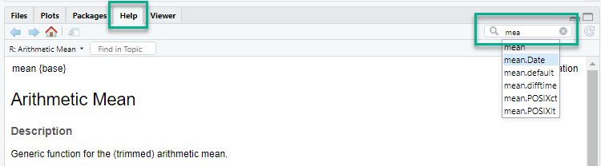

# Grundlæggende R {#grundlæggende_r}
Du kan vælge at skrive dine R kommandoer enten i det øverste vindue til venstre eller det nederste vindue til venstre.

Forskellen er:

* *øverst*  - kan du gemme dine R kommandoer og de afvikles med *CTRL + Enter*
* *nederst* - bliver kommandoen ikke gemt men afviklet når du trykker *Enter*

Du skal bruge **<-** nårt du vil tildele en værdi til en variable/objekt

```{r eval=FALSE}
x <- 10
navn <- "Tue"
```

Her oprettes to objekter; *x* og *navn*
og de tildeles en værdi.

Du kan se disse objekter i vinduet øverst til højre under *Enviroment*


Du kan "*udlæse*" værdien af dine objekter ved at skrive navnet på objektet

```{r eval=FALSE}
x
navn
```


## Funktioner
Som i alle andre programmeringssprog har R en masse funktioner, nogle af dem vil du også kunne genkende fra Excel.

Når man udvider R's funktionalitet via pakker kommer der også nye funktioner til.

Her er nogle af de mest almindelige funktioner:

```{r eval=FALSE}
length(y)     # Antallet af numre i vektoren
min(y)        # Minimumsværdien
max(y)        # Maksimumværdien
median(y)     # Medianen
sum(y)        # Summen
mean(y)       # Gennemsnittet
var(y)        # Variansen
sd(y)         # Standardafvigelsen
```

Eksempel på en funktion
```{r eval=FALSE}
tal <-  c(1, 2, 3, 4, 5)

sum(tal)
mean(tal)
```

## Logiske operatorer
Når du skriver kode får du meget hurtigt brug for noget logik, det kan være du skal finde alle værdier der er større end middelværdien eller...

Her er de mest brugte logiske operatorer:

```{r eval=FALSE}
x == 2        # "==" betyder "lig med"
x != 2        # "!=" betyder "ikke lig med"
x < 1         # "<" betyder "mindre end"
x > 1         # ">" betyder "større end"
x <= 2        # "<=" betyder "mindre eller lig med
```

*Hvis de bare bruges som de står her vil de returnere TRUE eller FALSE*

```{r eval=FALSE}
x <- 2
x == 2
x > 2
```


## Hjælp
R har en rigtig god indbygget hjælpe funktion.
Du kan enten få hjælpen frem via kode eller via GUI i RStudie.
Uanset om du brugere kode eller GUI, så bliver hjælpen vist i det nederste højre vindue under fanen *Help*



**GUI**
I RStudio kan du søge i det lille felt oppe i den højre hjørne af hjælpe vinduet.
Du kan søge efter funktioner eller hele pakker.


**Kode**
Kun kan også få hjælpen frem via kode

```{r eval=FALSE}
help("mean") # Hjælp til en specifik funktion - mean
help("plot")

?mean 
?plot
```

Du kan også få hjælp til en specifik pakke - her **base** og **tidyverse**

```{r eval=FALSE}
help(package = "base")
help(package = "tidyverse")
```


## tidyverse - pipe

Tidyverse pakken som kommer i brug senere i dette kursus, gør brug af en lidt speciel måde at skrive R koden på - *pipe* som er *%>%*

Du kan få den "frem" ved at bruge genvejstasten:

* Winows  - *CTRL + SHIFT + M*
* Mac - *CMD + SHIFT + M*

Uden pipe
```{r eval=FALSE}
mean(1:10)
```

Med pipe
```{r eval=FALSE}
1:10 %>%
    mean()
```

Pipe kan beskrives på følgende måde:
```{r eval=FALSE}
data %>%
    gør-noget() %>%
    gør-noget-andet() %>%
    gør-det-sidste()
    
northwind_ugedag_salg <- northwind_samlet %>%
  mutate(Total = Quantity * UnitPrice) %>%
  mutate(Weekday = weekdays(ShippedDate)) %>%
  filter(is.na(ShippedDate) == FALSE) %>%
  select(Weekday, Total) %>%
  group_by(Weekday) %>%
  summarise(sum(Total))    
```
