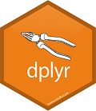

# "Omdanne" {#omdanne}
Du vil have brug for at ændre de data som du arbejder med. Det kan være at der skal tilføjes nye koloner eller der er koloner der ikke skal bruges til noget.


## dplyr



dplyr er en *grammar of data manipulation*
Du kan læse mere om dplyr pakken her: <a href="https://dplyr.tidyverse.org/index.html" target="_blank">dplyr.tidyverse.org/index.html</a>

dplyr hjælper dig med at løse de mest almindelige udfordringer ved datamanipulation:

* **mutate()** - tilføjer nye felter/koloner
* **select()** - vælger koloner
* **filter()** - vælger rækker baseret på filterværdien
* **summarise()** - gruppere værdier
* **arrange()** - ændrer rækkefølgen af rækkerne

### Eksempler

```{r eval=FALSE}
library(readxl)
northwind <- read_excel("northwind.xlsx")
```

## join
Ofte, når du arbejder med forskellige datasæt, de kan være eksporteret fra en database eller "selvstændige" CSV filer.

I en database er det muligt at sammenføje disse data på en fælles nøgle eller kolonne. I Excel kan du bruge *Lookup funktioner* som *hlookup* til dette. 
Denne form for sammenføjning/sammenlægning af data kaldes at *joine* data. Det er meget brugt i en database og *dplyr* understøtter det også.

Du har adgang til følgende *join* muligheder:

* Inner Join (inner_join)
* Left Join (left_join)
* Right Join (right_join)
* Full Join (full_join)
* Semi Join (semi_join)
* Anti Join (anti_join)

Syntaksen for at fortage et *join* mellem to tabeller er:

```{r eval=FALSE}
join_type(firstTable, secondTable, by=columnTojoinOn)
```

Den mest bruge *join* type er *left_join*, så det er den jeg vil bruge her.
Hvis du er interessert i de andre typer, kan du læse om dem her: <a href="https://dplyr.tidyverse.org/reference/join.html" target="_blank">dplyr.tidyverse.org/reference/join.html</a>, <a href="http://www.sql-join.com" target="_blank">www.sql-join.com</a>

### Eksempel - left_join
Med udgangspunkt i *Northwind* er her 2 eksampler:

```{r eval=FALSE}

```


