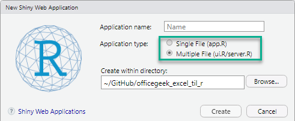

# Kommuniker {#kommuniker}
Med pakken *shiny* er det muligt for dig at opbygge og dele interaktive web applikationer direkte fra R.

Du dele dine web applikationer via *ShinyApps.io*


## ShinyApps.io
Hvis du skal dele det med mange andre, er der muligt at bruge en cloud løsning – ShinyApps.io

Hvis du vil bruge ShinyApps.io skal følgende være på plads:

•	Du skal også bruge pakken rsconnect
•	Du skal oprette din på ShinyApps.io som brugere
•	Du skal bruge en token fra din konto i din App

ShinyApps.io har flere forskellige løsninger startende ved en gratis til en løsning der koster 299 USD pr. måned.

Den gratis løsning indeholder følgende:

•	5 Applikationer
•	25 Aktive Hosts
•	Support via deres www side
•	Logo fra RStudio i din applikation

## Opret forbindelse
For at publicere din applikation på ShinyApps.io skal du gøre følgende:

1.	Opret og test din løsning lokalt
2.	Klik på knappen Publish to Server
3.	Vælg ShinyApps.io
4.	Du skal kopiere din Token fra ShinyApps.io ind i dette vindow 
Du skal gå ind på konto på ShinyApps.io og vælge:
**Account – Tokens** – Kopier din token – Husk klik på knappen **Show secret** før du kopierer

ShinyApps.io har en rigtig god dokumentation som du kan finde her: https://docs.rstudio.com/shinyapps.io/index.html

## Standard eksempler
*Shiny* har 11 eksempeler der på en god måde viser de muligheder du har med *Shiny*.

Du kan afvikle dem på denne måde:

```{r eval=FALSE}
# Demo løsninger
install.packages("shiny")
library(shiny)

runExample("01_hello")
runExample("02_text")
runExample("03_reactivity")
runExample("04_mpg")
runExample("05_sliders")
runExample("06_tabsets")
runExample("07_widgets")
runExample("08_html")
runExample("09_upload")
runExample("10_download")
runExample("11_timer")
```

Det gode ved disse eksempler er at kode bliver vist sammen med eksemplet, hvilket gør det nemt selv at prøve løsningen.

## Struktur
En Shimy App er ”samlet” i et enkelt script app.R som du kan afvikle.

app.R består af tre dele:

* Userinterface (ui.R)  
Her styrer du layout af din applikation
* Server (server.R)  
Her definere du det der skal til for at opbygge din løsning
* Kald til shinyApp function  
Her bygges selev løsningen


Du kan oprette en ny shiny App under: **File – New File – Shiny Web App**

I dette vindue skal du indtaste navnet på din App og placeringen. Du har også mulighed for at vælge mellem og din App skal opdeles i to file, **ui.R** og **server.R**, eller om du vil have alt i en fil.



Opdelingen i to filer giver dig de fleste muligheder og en bedre kontrol.

Du får to filer der indeholder en demo løsning som du kan bruge som udgangspunkt for din løsning.

## Eksempel


